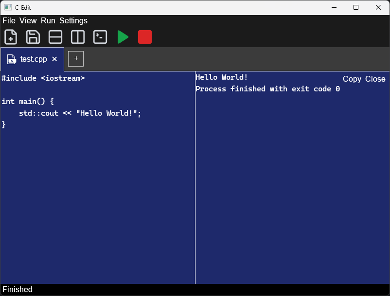

# C Edit

A lightweight and simple code editor for learning C/C++ development written in C++ using [Ultralight](https://ultralig.ht/) framework.

## Building

- Clone recursively
- Build with CMake
